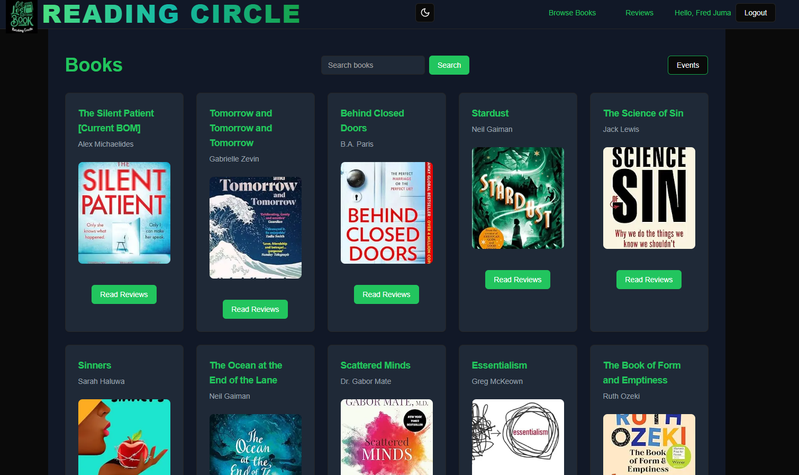

<link
  rel="stylesheet"
  href="https://cdn.jsdelivr.net/gh/dheereshagrwal/colored-icons@1.7.5/src/app/ci.min.css"
/>

Reading Circle 📚 is a bookclub that aims to connect booklovers
======================================

the project is a website that catalogues books read by the members of the book club. The website allows members to comment on the books and share a star rating. The website also allows members to see the books that have been read by the book club.

## Features
- Browse books (incude search by book title)
- Add books
- Review on books
- Rate books

## Tech Stack

<code></code>
<code></code>
	<code></code>
	

## More libraries and APIs used
- Wix headless CMS for storing books data
- shadcn (UI library)

## Screenshots

THE INTERFACE ⬇️⬇️⬇️

you can support me by giving a star to this repo ⭐️

Also you can financially support me by buying me a coffee ☕️

  